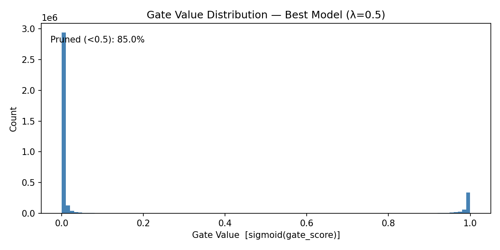

# Self-Pruning Neural Network on CIFAR-10  
### Tredence Analytics — AI Engineering Internship 2025 | Case Study Submission  

---

## Problem Statement

Deploying large neural networks in real-world environments is constrained by memory usage and computational cost. Traditional pruning techniques remove unimportant weights after training, requiring additional steps such as retraining or fine-tuning.

This project proposes a more efficient approach where the network learns to prune itself during training, eliminating the need for post-processing.

---

## Core Methodology

Each weight in the network is paired with a learnable gate parameter:

- Gate value = sigmoid(gate_score) ∈ (0, 1)  
- Effective weight = weight × gate

### Behavior

- Gate → 0 : Weight is effectively removed (pruned)  
- Gate → 1 : Weight is retained  

A custom L1 sparsity loss is applied to gate parameters, encouraging unimportant weights to shrink toward zero during training.

---

## Why L1 Regularization

| Property | L1 Regularization | L2 Regularization |
|----------|------------------|------------------|
| Gradient near zero | Constant | Vanishes |
| Produces exact zeros | Yes | No |
| Encourages sparsity | Strong | Weak |

L1 is chosen because it promotes true sparsity, similar to LASSO regression, whereas L2 only reduces magnitude without eliminating weights.

---

## Dataset

CIFAR-10  
- 10 image classes  
- 50,000 training samples  
- 10,000 test samples  
- Image size: 32 × 32 × 3  

---

## Model Design

- Convolutional Neural Network (CNN)
- Custom Prunable Layers
- Learnable gate parameters per weight
- Sigmoid-based gating mechanism
- Loss Function:
  - Cross-Entropy Loss
  - L1 Sparsity Loss on gates

---

## Training Configuration

- Total Epochs: 50  
  - 10 epochs: Warm-up phase  
  - 40 epochs: Pruning phase  
- Hardware: Google Colab (T4 GPU)  
- Optimizer: Adam  

---

## Results

| Lambda (λ) | Setting | Test Accuracy (%) | Sparsity (%) |
|:----------:|:--------|:----------------:|:-------------:|
| 0.1 | Low | 60.85 | 77.93 |
| 0.5 | Medium (Best) | 60.31 | 84.99 |
| 2.0 | High | 60.17 | 92.25 |

---

## Gate Value Distribution

---

## Interpretation of the Distribution

| Observation | Explanation |
|------------|-------------|
| Strong spike near 0 | Majority of weights are pruned (inactive) |
| Cluster near 1 | Important weights are preserved |
| Sparse middle region | Gates commit to binary decisions (0 or 1) |

---

## Key Insights

- Achieves ~85% sparsity with minimal accuracy loss  
- No post-training pruning required  
- Model becomes more efficient during training itself  
- Gate mechanism enables adaptive feature selection  

---

## Advantages

- Eliminates separate pruning stage  
- Reduces model size significantly  
- Improves inference efficiency  
- Suitable for deployment on constrained devices  

---

## Limitations

- Accuracy slightly decreases at very high sparsity  
- Sensitive to choice of λ (regularization strength)  
- Requires careful balancing of loss terms  

---

## Future Work

- Apply to larger datasets (e.g., ImageNet)  
- Combine with quantization techniques  
- Explore structured pruning (filter/channel level)  
- Deploy on edge hardware  

---

## Tech Stack

- Python  
- PyTorch  
- NumPy  
- Matplotlib  
- Google Colab  

---

## Conclusion

This project demonstrates a practical approach to integrating pruning directly into the training process. By learning gate parameters alongside weights, the model achieves high sparsity while maintaining performance.

The approach provides a scalable and efficient alternative to traditional pruning pipelines, making it suitable for real-world deployment scenarios.

---

## Repository

Add your GitHub repository link here  
